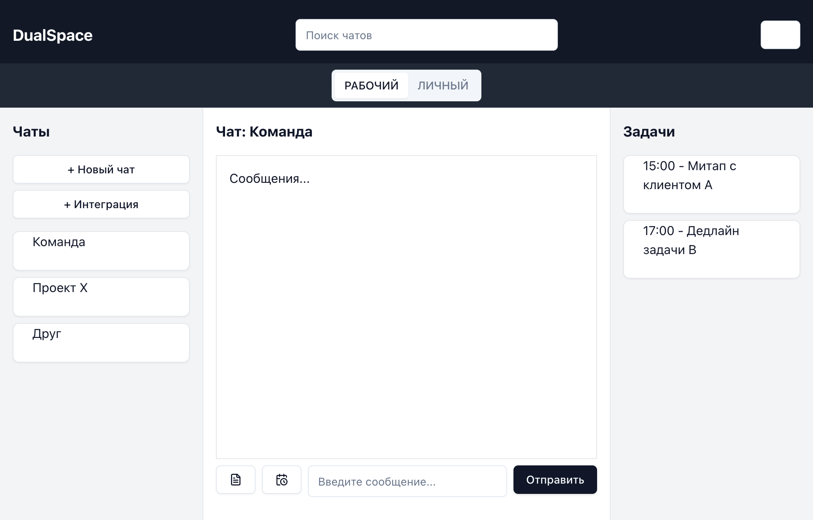

# otus-kotlin-developer

Учебный проект курса
[Kotlin Backend Developer](https://otus.ru/lessons/kotlin/).
Поток курса 2024-11.

**Messenger** — это программное обеспечение, предназначенное для обмена информацией между пользователями.

**Проблема существующих решений**

Главный недостаток современных мессенджеров — необходимость использовать отдельные приложения для рабочих и личных задач. 

Корпоративные мессенджеры, как правило, не имеют встроенных инструментов тайм-менеджмента (например, планирования задач, контроля времени), 
и их функционал расширяется только за счёт сторонних плагинов или интеграций.

**Цель разработки**
Программное обеспечение призвано объединить корпоративное и личное общение в единой платформе.

**Ключевые функции:**

- **Два режима работы:**

  - Быстрое переключение между рабочим и личным режимами.

  - Автоматическая сортировка контактов и чатов в зависимости от выбранного режима (например, отдельные группы для коллег и друзей).

- **Интеграция с инструментами планирования:**

  - Синхронизация с общим календарём.

  - Мгновенное создание встреч через подключённые сервисы (Google Meet, Zoom и другие видеоконференц-платформы) без перехода во внешние приложения.

- **Встроенный тайм-менеджмент:**

  - Напоминания о задачах и встречах.

  - Статистика времени, затраченного на рабочие/личные активности.

## Визуальная схема фронтенда

## Документация

1. Маркетинг и аналитика
    1. [Целевая аудитория](docs/01-biz/01-target-audience.md)
    2. [Заинтересанты](docs/01-biz/02-stakeholders.md)
    3. [Пользовательские истории](docs/01-biz/03-bizreq.md)
2. Аналитика:
    1. [Функциональные требования](docs/02-analysis/01-functional-requiremens.md)
    2. [Нефункциональные требования](docs/02-analysis/02-nonfunctional-requirements.md)
3. DevOps
    1. [Файлы сборки](deploy)
4. Архитектура
    1. [Описание API](docs/03-architecture/01-api.md)
    2. [Компонентная схема](docs/03-architecture/02-arch.md)
5. Тесты

# Структура проекта

## Подпроекты для занятий по языку Kotlin

1. Модуль 1: Введение в Kotlin
    1. [m1l1-first](ok-lessons/m1l1-first) - Вводное занятие, создание первой программы на Kotlin
    2. [m1l2-basic](ok-lessons/m1l2-basic) - Основные конструкции Kotlin
    3. [m1l3-func](ok-lessons/m1l3-func) - Функциональные элементы Kotlin
    4. [m1l4-oop](ok-lessons/m1l4-oop) - Объектно-ориентированное программирование
2. Модуль 2: Расширенные возможности Kotlin
    1. [m2l1-dsl](ok-lessons/m2l1-dsl) - Предметно ориентированные языки (DSL)
    2. [m2l2-coroutines](ok-lessons/m2l2-coroutines) - Асинхронное и многопоточное программирование с корутинами
    3. [m2l3-flows](ok-lessons/m2l3-flows) - Асинхронное и многопоточное программирование с Sequence и Flow
    4. [m2l4-kmp](ok-lessons/m2l4-kmp) - Мультиплатформенная разработка
    5. m2l5 - Интероперабельность Kotlin с другими языками
        1. [m2l5-1-interop](ok-lessons/m2l5-1-interop) - Интероперабельность Kotlin Native с C
        2. [m2l5-2-jni](ok-lessons/m2l5-2-jni) - Интероперабельность Kotlin JVM с C
    6. [m2l6-gradle](ok-lessons/m2l6-gradle) - Расширенные возможности Gradle

## Проектные модули
